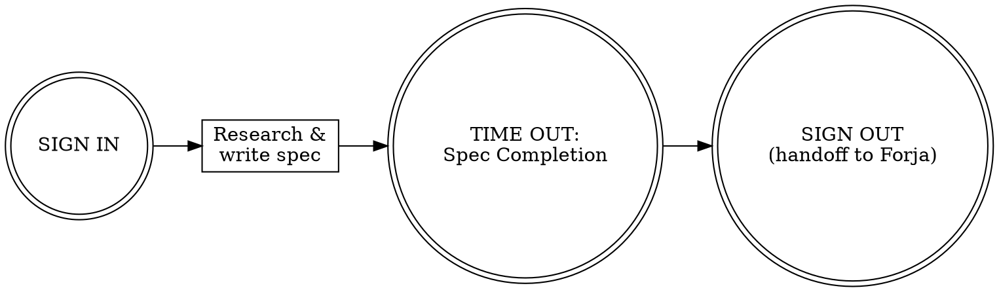
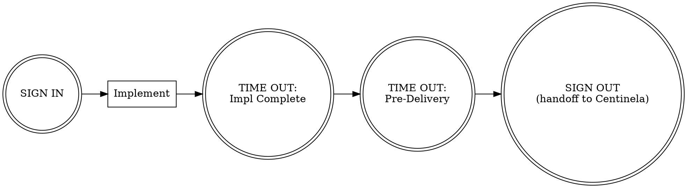
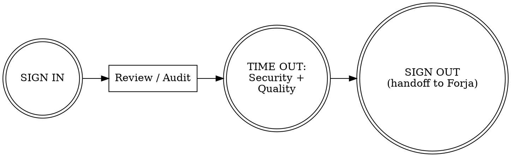
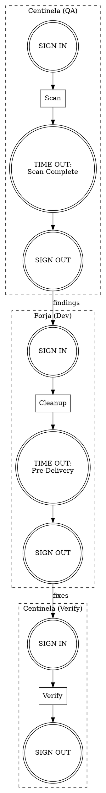

# Superpowers Adoption Implementation Plan

> **For agentic workers:** REQUIRED SUB-SKILL: Use superpowers:subagent-driven-development (recommended) or superpowers:executing-plans to implement this plan task-by-task. Steps use checkbox (`- [ ]`) syntax for tracking.

**Goal:** Adopt 7 capabilities from obra/superpowers into Agent Triforce's existing checklist framework

**Architecture:** Primarily embed new capabilities into existing agent checklists and pause points (A), with 4 standalone skills for use outside the full PM-Dev-QA ceremony (B). All changes are additive — no existing behavior is removed or changed, only enhanced.

**Tech Stack:** Markdown (agent configs, skills), POSIX shell (hooks), Graphviz DOT (flowcharts)

**Spec:** `docs/specs/superpowers-adoption.md`

---

## Task 1: Anti-Rationalization Tables

Add `### Rationalization Red Flags` subsection to each agent's `## Checklists` section, positioned before the Non-Normal checklists.

**Files:**
- Modify: `.claude/agents/prometeo-pm.md:241` (before NON-NORMAL section)
- Modify: `.claude/agents/forja-dev.md:209` (before NON-NORMAL section)
- Modify: `.claude/agents/centinela-qa.md:229` (before NON-NORMAL section)

- [ ] **Step 1: Add rationalization table to prometeo-pm.md**

Insert the following block at line 241, between the Spec Completion checklist's closing paragraph and the `### NON-NORMAL: Requirement Ambiguity` heading:

```markdown
### Rationalization Red Flags (DO-CONFIRM)
Scan after completing work — if any of these thoughts occurred, STOP and revisit:

| Thought | Reality |
|---|---|
| "The requirements are obvious, skip the spec" | Obvious requirements have the most hidden assumptions |
| "Let's just start building and figure it out" | That's how scope creep begins |
| "This stakeholder feedback can wait" | Delayed feedback = rework |
| "One more feature won't hurt" | YAGNI. Every feature has maintenance cost |
| "The spec is close enough" | Ambiguity in specs becomes bugs in code |
```

- [ ] **Step 2: Add rationalization table to forja-dev.md**

Insert the following block at line 209, between the Pre-Delivery checklist's closing paragraph and the `### NON-NORMAL: Build Failure Recovery` heading:

```markdown
### Rationalization Red Flags (DO-CONFIRM)
Scan after completing work — if any of these thoughts occurred, STOP and revisit:

| Thought | Reality |
|---|---|
| "Quick fix, investigate later" | Symptom fixes mask root causes |
| "Just try changing X and see" | Systematic debugging is faster than guess-and-check |
| "Skip the test, I'll manually verify" | Untested fixes don't stick |
| "This is too simple to need TDD" | Simple code has root causes too |
| "One more fix attempt" (after 2+ failures) | 3+ failures = architectural problem, not persistence problem |
| "I'll refactor while I'm here" | Stay focused on the task. Boy Scout Rule applies to code you touch, not code nearby |
```

- [ ] **Step 3: Add rationalization table to centinela-qa.md**

Insert the following block at line 229, between the Release Readiness checklist and the `### NON-NORMAL: Critical Vulnerability Response` heading:

```markdown
### Rationalization Red Flags (DO-CONFIRM)
Scan after completing work — if any of these thoughts occurred, STOP and revisit:

| Thought | Reality |
|---|---|
| "This finding is minor, skip it" | Minor findings compound into major vulnerabilities |
| "The dev already tested this" | Independent verification is the whole point of QA |
| "No time for a full audit" | Partial audits give false confidence |
| "This pattern is fine, I've seen it before" | Verify against current OWASP, don't trust memory |
| "Let me fix this myself instead of reporting it" | QA reports, Dev fixes. Role separation exists for a reason |
```

- [ ] **Step 4: Verify all three files parse correctly**

Run:
```bash
# Verify markdown structure — each file should have the new section
grep -n "Rationalization Red Flags" .claude/agents/prometeo-pm.md .claude/agents/forja-dev.md .claude/agents/centinela-qa.md
```
Expected: 3 matches, one per file.

- [ ] **Step 5: Commit**

```bash
git add .claude/agents/prometeo-pm.md .claude/agents/forja-dev.md .claude/agents/centinela-qa.md
git commit -m "feat: add anti-rationalization tables to all agent checklists

Adds DO-CONFIRM rationalization red flag tables to each agent's Checklists
section, positioned before Non-Normal checklists. Each table is tuned to
the agent's role-specific failure modes (PM: spec shortcuts, Dev: debugging
shortcuts, QA: review shortcuts). Inspired by obra/superpowers."
```

---

## Task 2: DOT Flowcharts

Add Graphviz `dot` process diagrams to all three agent files and update CLAUDE.md workflow diagrams.

**Files:**
- Modify: `.claude/agents/prometeo-pm.md:212-215` (workflow section)
- Modify: `.claude/agents/forja-dev.md:171-175` (workflow section)
- Modify: `.claude/agents/centinela-qa.md:183-187` (workflow section)
- Modify: `CLAUDE.md:60-76` (workflow pause-point diagrams)

- [ ] **Step 1: Add DOT flowchart to prometeo-pm.md**

Replace the existing plain-text workflow block at lines 212-215:

```
### Your Workflow
```
SIGN IN → research & write spec → TIME OUT: Spec Completion → SIGN OUT (with handoff to Forja)
```
```

With:

```markdown
### Your Workflow


```

- [ ] **Step 2: Add DOT flowchart to forja-dev.md**

Replace the existing plain-text workflow block at lines 171-175:

```
### Your Workflow
```
SIGN IN → implement → TIME OUT: Implementation Complete → TIME OUT: Pre-Delivery → SIGN OUT (with handoff to Centinela)
```
On fix cycles: `SIGN IN → fix findings → TIME OUT: Implementation Complete + Pre-Delivery → SIGN OUT`
```

With:

```markdown
### Your Workflow



On fix cycles: `SIGN IN → fix findings → TIME OUT: Implementation Complete + Pre-Delivery → SIGN OUT`
```

- [ ] **Step 3: Add DOT flowchart to centinela-qa.md**

Replace the existing plain-text workflow block at lines 183-187:

```
### Your Workflow
```
SIGN IN → review/audit → TIME OUT: Security Verification + Quality Verification → SIGN OUT (with handoff to Forja)
```
For releases: `SIGN IN → full audit → TIME OUT: Release Readiness → SIGN OUT (with summary to Prometeo)`
```

With:

```markdown
### Your Workflow



For releases: `SIGN IN → full audit → TIME OUT: Release Readiness → SIGN OUT (with summary to Prometeo)`
```

- [ ] **Step 4: Add DOT flowcharts to CLAUDE.md**

Replace the ASCII workflow diagrams at lines 62-76 in CLAUDE.md:

```
```
Standard Feature Flow:
PM  ⏸️ SIGN IN → spec → ⏸️ TIME OUT: Spec Completion → ⏸️ SIGN OUT
  → Dev ⏸️ SIGN IN → implement → ⏸️ TIME OUT: Implementation Complete → ⏸️ TIME OUT: Pre-Delivery → ⏸️ SIGN OUT
    → QA  ⏸️ SIGN IN → audit → ⏸️ TIME OUT: Security + Quality Verification → ⏸️ SIGN OUT
      → Dev ⏸️ SIGN IN → fix → ⏸️ TIME OUT: Implementation Complete + Pre-Delivery → ⏸️ SIGN OUT
        → QA  ⏸️ SIGN IN → re-verify → ⏸️ SIGN OUT
```

```
Code Health Flow:
QA  ⏸️ SIGN IN → scan → ⏸️ TIME OUT: Scan Complete → ⏸️ SIGN OUT
  → Dev ⏸️ SIGN IN → cleanup → ⏸️ TIME OUT: Pre-Delivery → ⏸️ SIGN OUT
    → QA  ⏸️ SIGN IN → verify → ⏸️ SIGN OUT
```
```

With:

````markdown
#### Standard Feature Flow

```dot
digraph standard_feature_flow {
    rankdir=TB;
    node [shape=box];

    subgraph cluster_pm {
        label="Prometeo (PM)";
        style=dashed;
        pm_signin [label="SIGN IN" shape=doublecircle];
        pm_spec [label="Write spec"];
        pm_timeout [label="TIME OUT:\nSpec Completion" shape=doublecircle];
        pm_signout [label="SIGN OUT" shape=doublecircle];
        pm_signin -> pm_spec -> pm_timeout -> pm_signout;
    }

    subgraph cluster_dev1 {
        label="Forja (Dev)";
        style=dashed;
        dev_signin [label="SIGN IN" shape=doublecircle];
        dev_impl [label="Implement"];
        dev_timeout1 [label="TIME OUT:\nImpl Complete" shape=doublecircle];
        dev_timeout2 [label="TIME OUT:\nPre-Delivery" shape=doublecircle];
        dev_signout [label="SIGN OUT" shape=doublecircle];
        dev_signin -> dev_impl -> dev_timeout1 -> dev_timeout2 -> dev_signout;
    }

    subgraph cluster_qa1 {
        label="Centinela (QA)";
        style=dashed;
        qa_signin [label="SIGN IN" shape=doublecircle];
        qa_audit [label="Audit"];
        qa_timeout [label="TIME OUT:\nSecurity + Quality" shape=doublecircle];
        qa_signout [label="SIGN OUT" shape=doublecircle];
        qa_signin -> qa_audit -> qa_timeout -> qa_signout;
    }

    subgraph cluster_dev2 {
        label="Forja (Fix Cycle)";
        style=dashed;
        dev2_signin [label="SIGN IN" shape=doublecircle];
        dev2_fix [label="Fix findings"];
        dev2_timeout [label="TIME OUT:\nImpl + Pre-Delivery" shape=doublecircle];
        dev2_signout [label="SIGN OUT" shape=doublecircle];
        dev2_signin -> dev2_fix -> dev2_timeout -> dev2_signout;
    }

    subgraph cluster_qa2 {
        label="Centinela (Re-verify)";
        style=dashed;
        qa2_signin [label="SIGN IN" shape=doublecircle];
        qa2_verify [label="Re-verify"];
        qa2_signout [label="SIGN OUT" shape=doublecircle];
        qa2_signin -> qa2_verify -> qa2_signout;
    }

    pm_signout -> dev_signin [label="handoff"];
    dev_signout -> qa_signin [label="handoff"];
    qa_signout -> dev2_signin [label="findings"];
    dev2_signout -> qa2_signin [label="fixes"];
}
```



#### Code Health Flow


````

- [ ] **Step 5: Verify DOT syntax in all modified files**

Run:
```bash
grep -c "digraph" .claude/agents/prometeo-pm.md .claude/agents/forja-dev.md .claude/agents/centinela-qa.md CLAUDE.md
```
Expected: prometeo-pm.md:1, forja-dev.md:1, centinela-qa.md:1, CLAUDE.md:2

- [ ] **Step 6: Commit**

```bash
git add .claude/agents/prometeo-pm.md .claude/agents/forja-dev.md .claude/agents/centinela-qa.md CLAUDE.md
git commit -m "feat: add DOT flowcharts to agent workflows and CLAUDE.md

Replaces ASCII workflow diagrams with Graphviz DOT format in all three
agent files and CLAUDE.md. Uses doublecircle for pause points, box for
actions, diamond for decisions. Inspired by obra/superpowers."
```

---

## Task 3: Self-Review Loops

Add self-review checklist items to existing TIME OUT checklists and create a standalone self-review skill.

**Files:**
- Modify: `.claude/agents/prometeo-pm.md:238-239` (Spec Completion checklist)
- Modify: `.claude/agents/forja-dev.md:198` (Implementation Complete checklist)
- Modify: `.claude/agents/forja-dev.md:206-207` (Pre-Delivery checklist)
- Modify: `.claude/agents/centinela-qa.md:217-218` (Quality Verification checklist)
- Create: `.claude/skills/self-review/SKILL.md`

- [ ] **Step 1: Add self-review item to Prometeo's Spec Completion checklist**

In `prometeo-pm.md`, add a new checklist item before the last item in Spec Completion (before "Edge cases called out in business rules" at line 238):

```markdown
- [ ] Self-review: placeholder scan, internal consistency, scope check, ambiguity check — fix inline
```

This makes the Spec Completion checklist 8 items (still within Boorman's 5-9 limit).

- [ ] **Step 2: Add self-review item to Forja's Implementation Complete checklist**

In `forja-dev.md`, add a new checklist item at the end of Implementation Complete (after "Type safety enforced" at line 198):

```markdown
- [ ] Self-review: placeholder scan on docs/comments, type consistency across files, scope creep check — fix inline
```

This makes Implementation Complete 7 items (within limit).

- [ ] **Step 3: Add self-review item to Forja's Pre-Delivery checklist**

In `forja-dev.md`, add a new checklist item at the end of Pre-Delivery (after "Folder structure reveals intent" at line 206):

```markdown
- [ ] Self-review: CHANGELOG entry matches actual changes, no contradictions between code and docs — fix inline
```

This makes Pre-Delivery 6 items (within limit).

- [ ] **Step 4: Add self-review item to Centinela's Quality Verification checklist**

In `centinela-qa.md`, add a new checklist item at the end of Quality Verification (after "No dead code" at line 218):

```markdown
- [ ] Self-review: findings internally consistent, severity ratings justified, no placeholder recommendations — fix inline
```

This makes Quality Verification 7 items (within limit).

- [ ] **Step 5: Create the standalone self-review skill**

Create `.claude/skills/self-review/SKILL.md`:

```markdown
---
name: self-review
description: >
  Inline verification for any written artifact — specs, plans, reviews, docs.
  Runs 4 checks in under 60 seconds. Use on demand outside the triforce flow,
  or rely on TIME OUT checklists during normal agent operations.
---

# Self-Review

Run 4 checks on the artifact at: $ARGUMENTS

## The Protocol (under 60 seconds)

1. **Placeholder scan** — Search for "TBD", "TODO", incomplete sections, vague requirements, `{placeholder}` tokens. Fix each one.
2. **Internal consistency** — Do sections contradict each other? Do names/types match across references? Does architecture match feature descriptions? Fix contradictions.
3. **Scope check** — Is this focused enough for its purpose? Does it try to do too much? If it needs decomposition, flag it.
4. **Ambiguity check** — Could any requirement be interpreted two ways? Pick one interpretation and make it explicit.

## Rules

- **Fix inline, don't re-review.** When you find issues, fix them immediately. Don't run self-review again after fixing. The purpose is "catch the obvious," not "iterate to perfection."
- **This is NOT a subagent dispatch.** Read your own output with fresh eyes. Multi-agent review is a separate concern.
- **Report what you fixed.** After running all 4 checks, briefly state what was found and fixed (or "clean — no issues found").

## Output Format

```
Self-review of {artifact path}:
- Placeholder scan: {clean | fixed N items: list}
- Consistency: {clean | fixed: list}
- Scope: {focused | flagged: reason}
- Ambiguity: {clean | resolved N items: list}
```
```

- [ ] **Step 6: Verify checklist item counts are within Boorman's limits**

Run:
```bash
# Count checklist items in each modified section
echo "Prometeo Spec Completion:" && grep -c '^\- \[ \]' .claude/agents/prometeo-pm.md | head -1
echo "Forja Impl Complete:" && grep -A 20 'Implementation Complete' .claude/agents/forja-dev.md | grep -c '^\- \[ \]'
echo "Forja Pre-Delivery:" && grep -A 20 'Pre-Delivery' .claude/agents/forja-dev.md | grep -c '^\- \[ \]'
echo "Centinela Quality:" && grep -A 20 'Quality Verification' .claude/agents/centinela-qa.md | grep -c '^\- \[ \]'
```
Expected: All counts between 5 and 9.

- [ ] **Step 7: Commit**

```bash
git add .claude/agents/prometeo-pm.md .claude/agents/forja-dev.md .claude/agents/centinela-qa.md .claude/skills/self-review/SKILL.md
git commit -m "feat: add self-review loops to TIME OUT checklists + standalone skill

Adds inline self-review items to Prometeo Spec Completion, Forja
Implementation Complete and Pre-Delivery, and Centinela Quality
Verification checklists. Creates standalone self-review skill for
ad-hoc artifact verification. All checklist counts remain within
Boorman's 5-9 item limit."
```

---

## Task 4: Session-Start Hooks

Create the hooks directory, configuration, and bootstrap script.

**Files:**
- Create: `hooks/hooks.json`
- Create: `hooks/session-start/bootstrap.sh`

- [ ] **Step 1: Create hooks.json**

Create `hooks/hooks.json`:

```json
{
  "hooks": {
    "session-start": [
      {
        "command": "hooks/session-start/bootstrap.sh",
        "description": "Agent Triforce session bootstrap — surfaces in-progress work and pending items"
      }
    ]
  }
}
```

- [ ] **Step 2: Create bootstrap.sh**

Create `hooks/session-start/bootstrap.sh`:

```sh
#!/bin/sh
# Agent Triforce session bootstrap
# POSIX sh — no bash-isms (avoids bash 5.3+ hang bugs)
# Surfaces in-progress work for agent SIGN IN checklists

set -e

PROJECT_ROOT="$(git rev-parse --show-toplevel 2>/dev/null)" || exit 0
cd "$PROJECT_ROOT"

echo "[triforce-bootstrap] project: $(basename "$PROJECT_ROOT")"

# 1. Active worktrees
WORKTREE_COUNT=$(git worktree list | wc -l | tr -d ' ')
if [ "$WORKTREE_COUNT" -gt 1 ]; then
    git worktree list | tail -n +2 | while IFS= read -r line; do
        echo "[triforce-bootstrap] worktree: $line"
    done
fi

# 2. Uncommitted changes
DIRTY_COUNT=$(git status --porcelain 2>/dev/null | wc -l | tr -d ' ')
if [ "$DIRTY_COUNT" -gt 0 ]; then
    echo "[triforce-bootstrap] dirty: $DIRTY_COUNT uncommitted files"
fi

# 3. Pending specs (specs without corresponding review files)
if [ -d "docs/specs" ]; then
    for spec in docs/specs/*.md; do
        [ -f "$spec" ] || continue
        basename_no_ext=$(basename "$spec" .md)
        # Skip non-feature files
        case "$basename_no_ext" in
            README|backlog|feature-roadmap|future-roadmap|growth-plan|plugin-promotion-plan) continue ;;
        esac
        if [ ! -f "docs/reviews/${basename_no_ext}-review.md" ]; then
            echo "[triforce-bootstrap] pending-spec: $basename_no_ext (no review yet)"
        fi
    done
fi

# 4. Pending review findings (reviews with CHANGES REQUIRED verdict)
if [ -d "docs/reviews" ]; then
    for review in docs/reviews/*-review.md; do
        [ -f "$review" ] || continue
        if grep -q "CHANGES REQUIRED" "$review" 2>/dev/null; then
            echo "[triforce-bootstrap] open-findings: $(basename "$review")"
        fi
    done
fi

# 5. TECH_DEBT.md staleness
if [ -f "TECH_DEBT.md" ]; then
    LAST_MOD=$(stat -f "%m" "TECH_DEBT.md" 2>/dev/null || stat -c "%Y" "TECH_DEBT.md" 2>/dev/null || echo "0")
    NOW=$(date +%s)
    DAYS_OLD=$(( (NOW - LAST_MOD) / 86400 ))
    if [ "$DAYS_OLD" -gt 7 ]; then
        echo "[triforce-bootstrap] tech-debt: last updated $DAYS_OLD days ago"
    fi
fi
```

- [ ] **Step 3: Make bootstrap.sh executable**

Run:
```bash
chmod +x hooks/session-start/bootstrap.sh
```

- [ ] **Step 4: Test the bootstrap script**

Run:
```bash
sh hooks/session-start/bootstrap.sh
```
Expected: Output lines starting with `[triforce-bootstrap]`. At minimum: the project line and the pending-spec line for `superpowers-adoption`.

- [ ] **Step 5: Verify POSIX compliance**

Run:
```bash
# Check no bash-isms
if command -v checkbashisms >/dev/null 2>&1; then
    checkbashisms hooks/session-start/bootstrap.sh
else
    echo "checkbashisms not installed — manual review: no [[ ]], no (( )), no ${var//}, no arrays"
fi
```

- [ ] **Step 6: Commit**

```bash
git add hooks/hooks.json hooks/session-start/bootstrap.sh
git commit -m "feat: add session-start hooks for Agent Triforce bootstrap

Creates hooks/ directory with hooks.json config and POSIX-safe
bootstrap.sh that surfaces active worktrees, uncommitted changes,
pending specs, open review findings, and TECH_DEBT.md staleness.
Output feeds into agent SIGN IN checklists."
```

---

## Task 5: Git Worktrees Workflow

Create standalone git worktrees skill and add checklist items to Forja.

**Files:**
- Create: `.claude/skills/git-worktrees/SKILL.md`
- Modify: `.claude/agents/forja-dev.md:185-187` (SIGN IN checklist)
- Modify: `.claude/agents/forja-dev.md:250-256` (SIGN OUT checklist)

- [ ] **Step 1: Create the git-worktrees skill**

Create `.claude/skills/git-worktrees/SKILL.md`:

```markdown
---
name: git-worktrees
description: >
  Create and manage git worktrees for isolated feature work. Use when starting
  implementation that should not touch the main workspace, or for parallel
  development. Handles creation, baseline verification, and cleanup.
---

# Git Worktrees

Manage an isolated worktree for: $ARGUMENTS

## When to Use

- Starting feature implementation (keeps main workspace clean)
- Parallel development (multiple features simultaneously)
- Risky experiments (delete worktree if it fails, main untouched)
- Subagent isolation (agents work in worktree, can't pollute main)

## Create Worktree

```sh
PROJECT_ROOT="$(git rev-parse --show-toplevel)"
PROJECT_NAME="$(basename "$PROJECT_ROOT")"
FEATURE_NAME="{feature-name}"  # kebab-case, no spaces

WORKTREE_DIR="../${PROJECT_NAME}-worktrees/feat-${FEATURE_NAME}"
BRANCH_NAME="feat/${FEATURE_NAME}"

git worktree add -b "$BRANCH_NAME" "$WORKTREE_DIR"
cd "$WORKTREE_DIR"
```

## Verify Clean Baseline

After creating the worktree, run the project's test suite:

```sh
# Detect and run test command
if [ -f "package.json" ]; then
    npm test
elif [ -f "pyproject.toml" ] || [ -f "setup.py" ]; then
    pytest
elif [ -f "Cargo.toml" ]; then
    cargo test
elif [ -f "go.mod" ]; then
    go test ./...
fi
```

**If tests fail:** Fix baseline before starting implementation. Do not proceed with a broken baseline.

## During Implementation

- All work happens in the worktree directory
- Commit frequently to the feature branch
- Main workspace remains untouched
- Subagents receive the worktree path, not the main project path

## Finish Branch

When implementation is complete, present exactly these 4 options:

```
Implementation complete. What would you like to do?

1. Merge back to {base-branch} locally
2. Push and create a Pull Request
3. Keep the branch as-is (I'll handle it later)
4. Discard this work
```

### Option 1: Merge Locally
```sh
BASE_BRANCH="main"  # or detected base
cd "$PROJECT_ROOT"
git checkout "$BASE_BRANCH"
git pull
git merge "$BRANCH_NAME"
# Verify tests pass on merged result
git branch -d "$BRANCH_NAME"
git worktree remove "$WORKTREE_DIR"
```

### Option 2: Push + Create PR
```sh
git push -u origin "$BRANCH_NAME"
gh pr create --title "{title}" --body "## Summary
- {changes}

## Test Plan
- [ ] {verification steps}"
```
Worktree kept until PR merges.

### Option 3: Keep As-Is
Report worktree location. Do not clean up.

### Option 4: Discard
**Requires typed "discard" confirmation.**
```sh
cd "$PROJECT_ROOT"
git checkout "$BASE_BRANCH"
git branch -D "$BRANCH_NAME"
git worktree remove "$WORKTREE_DIR" --force
```

## Safety Rules

- Never create worktrees on `main`/`master` — always a new branch
- Always verify test baseline before starting work
- Discard requires typed confirmation — no accidental deletion
- Check `git worktree list` before creating to avoid duplicates
```

- [ ] **Step 2: Add worktree item to Forja's SIGN IN checklist**

In `forja-dev.md`, add after the last SIGN IN item ("Surfaced concerns, risks, or technical unknowns upfront" at line 187):

```markdown
- [ ] Created worktree for feature branch, or confirmed existing worktree is active
```

This makes SIGN IN 6 items (within Boorman's limit).

- [ ] **Step 3: Add finish-branch item to Forja's SIGN OUT checklist**

In `forja-dev.md`, add after "Stated build/test results" and before "Prepared handoff" (line 255):

```markdown
- [ ] If worktree active: presented finish-branch options (merge/PR/keep/discard), cleaned up if applicable
```

This makes SIGN OUT 6 items (within Boorman's limit).

- [ ] **Step 4: Verify checklist item counts**

Run:
```bash
echo "Forja SIGN IN:" && sed -n '/### SIGN IN/,/###/p' .claude/agents/forja-dev.md | grep -c '^\- \[ \]'
echo "Forja SIGN OUT:" && sed -n '/### SIGN OUT/,/$/p' .claude/agents/forja-dev.md | grep -c '^\- \[ \]'
```
Expected: SIGN IN: 6, SIGN OUT: 6

- [ ] **Step 5: Commit**

```bash
git add .claude/skills/git-worktrees/SKILL.md .claude/agents/forja-dev.md
git commit -m "feat: add git worktrees workflow skill + Forja checklist items

Creates standalone git-worktrees skill with worktree lifecycle
management (create, verify baseline, finish branch with 4 options).
Adds worktree checklist items to Forja SIGN IN and SIGN OUT."
```

---

## Task 6: Visual Brainstorming Companion

Create standalone visual companion skill and add checklist item to Prometeo.

**Files:**
- Create: `.claude/skills/visual-companion/SKILL.md`
- Modify: `.claude/agents/prometeo-pm.md:226-227` (SIGN IN checklist)

- [ ] **Step 1: Create the visual-companion skill**

Create `.claude/skills/visual-companion/SKILL.md`:

```markdown
---
name: visual-companion
description: >
  Browser-based companion for showing mockups, diagrams, wireframes, and visual
  comparisons during design conversations. Uses chrome MCP tools. Falls back to
  text-only if unavailable. Use during brainstorming or any visual design work.
---

# Visual Brainstorming Companion

A browser-based tool for visual design work during: $ARGUMENTS

## Availability Check

Before offering the companion, check if browser tools are available:
- If `mcp__claude-in-chrome__*` tools are accessible: companion is available
- If not: proceed text-only, do not offer the companion, this is not an error

## Consent Flow

**Offer once per session, in its own message (no other content):**

> Some of what we're working on might be easier to explain if I can show it to you in a web browser. I can put together mockups, diagrams, comparisons, and other visuals as we go. Want to try it?

Wait for response. If declined, proceed text-only.

## Per-Question Decision Rule

Even after acceptance, decide FOR EACH QUESTION whether to use browser or terminal:

**Use the browser** when the user would understand better by SEEING it:
- Mockups and wireframes
- Layout comparisons (side-by-side)
- Architecture diagrams (boxes and arrows)
- Data flow visualizations
- State machine diagrams
- Color/typography comparisons

**Use the terminal** when the content is fundamentally TEXT:
- Requirements questions
- Conceptual choices
- Tradeoff lists
- Scope decisions
- Technical constraints
- A/B/C option descriptions

**A question about a UI topic is not automatically visual.** "What does personality mean here?" is terminal. "Which layout works better?" is browser.

## Rendering Guidelines

When rendering in the browser:

1. Create a new tab with `mcp__claude-in-chrome__tabs_create_mcp`
2. Use `mcp__claude-in-chrome__navigate` to load an HTML data URI or local file
3. Render with:
   - Tailwind CSS for styling (via CDN)
   - Clean, semantic HTML
   - Dark/light mode support
   - Responsive layout

### What to Render
- **Architecture diagrams**: HTML/CSS boxes with flexbox/grid, connecting lines
- **UI mockups**: Tailwind-styled components at realistic sizes
- **Comparisons**: Split-pane layouts, side-by-side options with labels
- **Data flows**: Labeled boxes with directional arrows
- **State machines**: Node-edge diagrams with transition labels

### Rendering Rules
- Keep each visual focused on ONE question or comparison
- Label everything clearly — the visual should be self-explanatory
- Use consistent colors: primary for focus, gray for context, red for warnings
- Include a title describing what the visual shows
```

- [ ] **Step 2: Add visual companion item to Prometeo's SIGN IN checklist**

In `prometeo-pm.md`, add after "Surfaced concerns, risks, or unknowns upfront" (line 227):

```markdown
- [ ] Assessed if design involves visual questions — offered companion if so (see visual-companion skill)
```

This makes SIGN IN 6 items (within Boorman's limit).

- [ ] **Step 3: Verify checklist count**

Run:
```bash
echo "Prometeo SIGN IN:" && sed -n '/### SIGN IN/,/###/p' .claude/agents/prometeo-pm.md | grep -c '^\- \[ \]'
```
Expected: 6

- [ ] **Step 4: Commit**

```bash
git add .claude/skills/visual-companion/SKILL.md .claude/agents/prometeo-pm.md
git commit -m "feat: add visual brainstorming companion skill + Prometeo checklist item

Creates visual-companion skill using chrome MCP tools for browser-based
mockups and diagrams during design conversations. Adds visual assessment
item to Prometeo SIGN IN checklist. Graceful text-only fallback when
chrome tools unavailable."
```

---

## Task 7: Subagent Orchestration (Forja as Orchestrator)

Create prompt templates for three subagent roles, standalone orchestration skill, and update Forja's agent config with orchestrator logic.

**Files:**
- Create: `.claude/agents/forja-prompts/implementer-prompt.md`
- Create: `.claude/agents/forja-prompts/spec-reviewer-prompt.md`
- Create: `.claude/agents/forja-prompts/code-quality-reviewer-prompt.md`
- Create: `.claude/skills/subagent-orchestration/SKILL.md`
- Modify: `.claude/agents/forja-dev.md` (add orchestrator section + checklist updates)

- [ ] **Step 1: Create implementer-prompt.md**

Create `.claude/agents/forja-prompts/implementer-prompt.md`:

```markdown
# Implementer Subagent Prompt

You are an implementation subagent dispatched by Forja (the orchestrator). Your job is to implement ONE task from an implementation plan.

## Context

**Project:** {PROJECT_DESCRIPTION}
**Working directory:** {WORKTREE_PATH}
**Task:** {TASK_NUMBER} of {TOTAL_TASKS}

## Your Task

{FULL_TASK_TEXT}

## Instructions

1. **Read the task completely** before writing any code
2. **If anything is unclear**, respond with status `NEEDS_CONTEXT` and list your questions. Do NOT guess.
3. **Follow TDD**: write failing test first, verify it fails, implement minimal code, verify it passes
4. **Commit after each logical unit** with conventional commit messages
5. **Self-review before reporting**: read your own diff, check for typos, missing imports, inconsistencies

## Constraints

- Only modify files listed in the task's **Files** section
- Follow existing code patterns and conventions in the project
- Do NOT refactor code outside your task scope
- Do NOT add features not specified in the task

## Status Report

When done, report ONE of these statuses:

**DONE** — Task complete, tests pass, committed.
Include: files changed, test results, commit SHAs.

**DONE_WITH_CONCERNS** — Task complete, but something feels off.
Include: files changed, test results, commit SHAs, AND specific concerns.

**NEEDS_CONTEXT** — Cannot proceed without additional information.
Include: specific questions (not open-ended).

**BLOCKED** — Cannot complete the task.
Include: what you tried, why it failed, what would unblock you.
```

- [ ] **Step 2: Create spec-reviewer-prompt.md**

Create `.claude/agents/forja-prompts/spec-reviewer-prompt.md`:

```markdown
# Spec Compliance Reviewer Prompt

You are a spec compliance reviewer dispatched by Forja (the orchestrator). Your job is to verify that the implementer's work matches the specification exactly — nothing missing, nothing extra.

## Context

**Spec:** {SPEC_PATH}
**Task:** {TASK_NUMBER} — {TASK_TITLE}
**Task requirements:** {TASK_TEXT}
**Files changed:** {FILES_LIST}
**Commits to review:** {BASE_SHA}..{HEAD_SHA}

## Your Review Process

1. **Read the task requirements** from the plan (provided above)
2. **Read the actual code changes** independently — `git diff {BASE_SHA}..{HEAD_SHA}`
3. **Compare requirement by requirement:**
   - Is each requirement from the task implemented?
   - Is anything implemented that was NOT in the task?
   - Do the tests verify the requirements (not just the implementation)?

## Critical Rule

**Do NOT trust the implementer's self-report.** Read the code yourself. The implementer may believe they completed everything but missed a requirement or added unrequested functionality.

## Verdict

**PASS** — Every requirement implemented, nothing extra, tests verify requirements.

**FAIL** — List each issue:
- `MISSING: {requirement}` — required but not implemented
- `EXTRA: {what was added}` — implemented but not in spec
- `WRONG: {requirement} — {what's wrong}` — implemented but incorrect
- `UNTESTED: {requirement}` — implemented but no test verifies it
```

- [ ] **Step 3: Create code-quality-reviewer-prompt.md**

Create `.claude/agents/forja-prompts/code-quality-reviewer-prompt.md`:

```markdown
# Code Quality Reviewer Prompt

You are a code quality reviewer dispatched by Forja (the orchestrator). You review AFTER spec compliance has passed. Your focus is implementation quality, not spec coverage (that's already verified).

## Context

**Commits to review:** {BASE_SHA}..{HEAD_SHA}
**Files changed:** {FILES_LIST}

## Review Criteria

### Code Quality
- Functions under 30 lines, single responsibility
- Meaningful names (intention-revealing, no abbreviations)
- DRY — no duplication
- No code smells: long method, feature envy, data clumps, primitive obsession
- Error handling: explicit, no swallowed exceptions, no bare except

### Architecture
- Dependencies point inward (Clean Architecture)
- No business logic in infrastructure layer
- Interfaces used at boundaries

### Test Quality
- Tests follow Arrange-Act-Assert pattern
- Tests are isolated (no shared mutable state)
- Tests verify behavior, not implementation details
- No test logic (no if/else or loops in tests)

### Cleanliness
- No dead code, unused imports, commented-out code
- No hardcoded secrets or config values
- No TODO/FIXME without issue reference

## Severity Classification

- **Critical**: Security vulnerability, data loss risk, correctness bug
- **Important**: Code smell, missing error handling, test gap
- **Minor**: Style, naming, minor duplication

## Verdict

**APPROVED** — Code quality is good. List strengths.

**NEEDS_CHANGES** — List issues by severity:
```
Critical: {list}
Important: {list}
Minor: {list}
```
Only Critical and Important block progress. Minor issues are noted for awareness.
```

- [ ] **Step 4: Create the standalone subagent-orchestration skill**

Create `.claude/skills/subagent-orchestration/SKILL.md`:

```markdown
---
name: subagent-orchestration
description: >
  Execute an implementation plan by dispatching fresh subagents per task with
  two-stage review (spec compliance, then code quality). Use for ad-hoc plan
  execution outside the full triforce ceremony.
---

# Subagent Orchestration

Execute the plan at: $ARGUMENTS

## Process

1. **Read the plan file** — extract all tasks with full text
2. **Create task tracking** — one todo per task
3. **For each task:**
   a. Select model tier based on task complexity (see Model Selection below)
   b. Dispatch implementer subagent using `.claude/agents/forja-prompts/implementer-prompt.md`
   c. Handle implementer status (DONE / DONE_WITH_CONCERNS / NEEDS_CONTEXT / BLOCKED)
   d. Dispatch spec-reviewer subagent using `.claude/agents/forja-prompts/spec-reviewer-prompt.md`
   e. If spec review fails: implementer fixes, re-review (loop until PASS)
   f. Dispatch code-quality-reviewer subagent using `.claude/agents/forja-prompts/code-quality-reviewer-prompt.md`
   g. If quality review fails: implementer fixes Critical/Important issues, re-review
   h. Mark task complete
4. **After all tasks:** run full test suite, verify everything works together

## Model Selection

| Task Signals | Model | Examples |
|---|---|---|
| 1-2 files, complete spec, mechanical | `haiku` | Add a field, write a test, rename |
| Multi-file, integration, judgment needed | `sonnet` | Wire up endpoint, refactor module |
| Architecture, design, broad codebase | `opus` | Design subsystem, complex debug |

## Subagent Dispatch Rules

- **Sequential only** for implementation subagents (avoids file conflicts)
- **Spec review before code quality review** (order matters)
- **Review loops repeat until approved** — no "close enough"
- **Never make subagents read the plan file** — provide full task text in the prompt
- **If implementer asks questions:** answer clearly, then re-dispatch
- **If implementer is BLOCKED:** assess and escalate (don't retry blindly)

## Red Flags

- Starting code quality review before spec compliance passes
- Dispatching multiple implementers in parallel
- Ignoring DONE_WITH_CONCERNS status
- Skipping re-review after implementer fixes
- Forcing retry without changing context, model, or task scope
```

- [ ] **Step 5: Add orchestrator section to forja-dev.md**

In `forja-dev.md`, add a new section after `### 4. Naming Conventions` (after line 93) and before `## Engineering Principles`:

```markdown
### 5. Subagent Orchestration

When implementing a plan with multiple tasks, operate as an **orchestrator**:

1. Read the plan once, extract all tasks with full text
2. Dispatch a fresh subagent per task using prompt templates in `.claude/agents/forja-prompts/`
3. After each implementer completes: dispatch spec-reviewer, then code-quality-reviewer
4. Review loops repeat until both reviewers approve
5. Select model tier per task: `haiku` for mechanical, `sonnet` for integration, `opus` for architecture

Prompt templates:
- `.claude/agents/forja-prompts/implementer-prompt.md`
- `.claude/agents/forja-prompts/spec-reviewer-prompt.md`
- `.claude/agents/forja-prompts/code-quality-reviewer-prompt.md`

See the `subagent-orchestration` skill for the standalone workflow.
```

- [ ] **Step 6: Add orchestration checklist items to Forja**

In `forja-dev.md`, add to the Implementation Complete checklist (after the existing last item):

```markdown
- [ ] All subagent tasks marked complete, all spec + quality reviews passed (if orchestrating)
```

In `forja-dev.md`, add to the SIGN OUT checklist (after the existing last item):

```markdown
- [ ] Subagent orchestration summary included in handoff to Centinela (if orchestrating)
```

- [ ] **Step 7: Update Forja's skills list in frontmatter**

In `forja-dev.md`, update the `skills:` list in the frontmatter to include the new skills:

```yaml
skills:
  - implement-feature
  - subagent-orchestration
  - git-worktrees
```

- [ ] **Step 8: Verify all new files exist and Forja's checklist counts**

Run:
```bash
ls -la .claude/agents/forja-prompts/
ls -la .claude/skills/subagent-orchestration/SKILL.md
grep -c "digraph\|Rationalization\|Self-review\|subagent.*complete\|worktree\|orchestration summary" .claude/agents/forja-dev.md
```
Expected: All files exist. grep count shows all additions are present.

- [ ] **Step 9: Commit**

```bash
git add .claude/agents/forja-prompts/ .claude/skills/subagent-orchestration/SKILL.md .claude/agents/forja-dev.md
git commit -m "feat: add subagent orchestration — Forja as orchestrator

Creates three prompt templates (implementer, spec-reviewer,
code-quality-reviewer) for two-stage subagent review workflow.
Creates standalone subagent-orchestration skill for ad-hoc plan
execution. Updates Forja with orchestrator section, model selection
guidance, and orchestration checklist items."
```

---

## Final Verification

After all 7 tasks are complete:

- [ ] **Run full verification**

```bash
# All agent files have rationalization tables
grep -l "Rationalization Red Flags" .claude/agents/*.md | wc -l
# Expected: 3

# All agent files have DOT flowcharts
grep -l "digraph" .claude/agents/*.md | wc -l
# Expected: 3

# CLAUDE.md has DOT flowcharts
grep -c "digraph" CLAUDE.md
# Expected: 2

# All new skills exist
ls .claude/skills/self-review/SKILL.md .claude/skills/git-worktrees/SKILL.md .claude/skills/visual-companion/SKILL.md .claude/skills/subagent-orchestration/SKILL.md
# Expected: 4 files listed

# Hooks exist
ls hooks/hooks.json hooks/session-start/bootstrap.sh
# Expected: 2 files listed

# Prompt templates exist
ls .claude/agents/forja-prompts/*.md
# Expected: 3 files listed

# Bootstrap script runs
sh hooks/session-start/bootstrap.sh
# Expected: [triforce-bootstrap] output lines

# No checklist exceeds 9 items (spot check)
echo "Checking Boorman compliance..."
```

- [ ] **Final commit (if any loose changes)**

```bash
git status
# If clean: done
# If dirty: commit remaining changes
```
