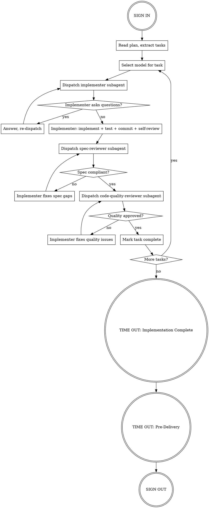
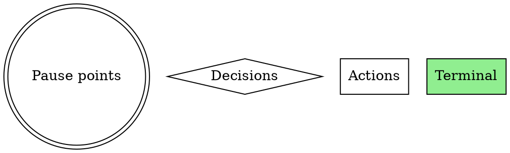
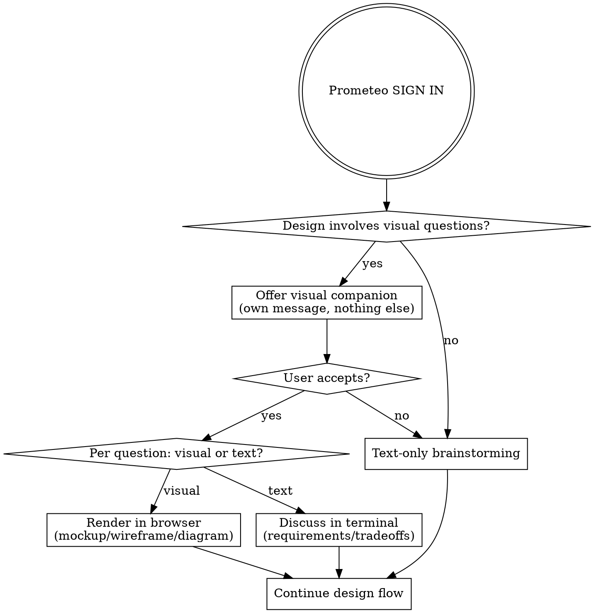
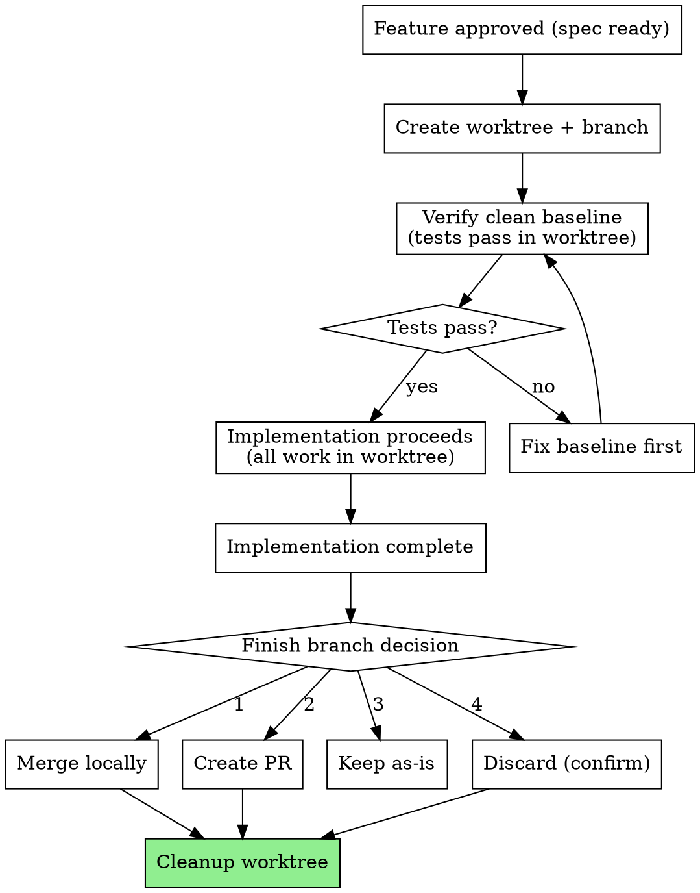

# Superpowers Adoption — Feature Specification

**Date:** 2026-03-29
**Author:** Prometeo (PM)
**Status:** Draft
**Source:** Review of [obra/superpowers](https://github.com/obra/superpowers) v5.0.6
**Tier:** L (7 sub-features, cross-cutting changes across all 3 agents + new skills + hooks)

## Summary

Adopt 7 capabilities from the obra/superpowers project into Agent Triforce's existing checklist framework. The integration follows an "A + a little B" strategy: primarily embed new capabilities into existing agent checklists and pause points (A), while giving 4 of the 7 capabilities standalone skill access for use outside the full PM-Dev-QA ceremony (B).

## Design Philosophy

### What stays the same

- 3 agents (Prometeo, Forja, Centinela) with role separation
- SIGN IN / TIME OUT / SIGN OUT pause points (WHO surgical safety model)
- Communication Schedule handoffs
- Non-Normal checklists for error recovery
- IEEE 830 + INVEST spec methodology
- Boorman's checklist design rules (5-9 items, <60 seconds, clear pause points)

### What changes

- Agents get anti-rationalization tables (behavior correction)
- Session hooks bootstrap the system automatically (no manual setup)
- Forja becomes a subagent orchestrator during implementation (dispatches fresh agents per task)
- TIME OUT checklists gain self-review loops
- All agent/skill files gain DOT flowcharts for process clarity
- Prometeo gains a visual brainstorming companion for design conversations
- Forja gains git worktree management for isolated feature branches

### Integration styles

| # | Enhancement | Style | Rationale |
|---|---|---|---|
| 1 | Anti-rationalization tables | Pure A | These ARE checklist items, no standalone use case |
| 2 | Session-start hooks | Pure A | Hooks serve the agents, not independent of them |
| 3 | Subagent orchestration | A + B hybrid | Forja orchestrates by default; standalone skill for ad-hoc plan execution |
| 4 | Self-review loops | A + B hybrid | Baked into TIME OUT checklists; standalone skill for reviewing any doc |
| 5 | DOT flowcharts | Pure A | Documentation enhancement, not a workflow |
| 6 | Visual brainstorming companion | A + B hybrid | Integrates with Prometeo's spec flow; standalone for any design conversation |
| 7 | Git worktrees workflow | A + B hybrid | Forja uses by default; standalone for ad-hoc isolation |

---

## Feature 1: Anti-Rationalization Tables

### Purpose

Add tables of "stop and check yourself" thoughts to each agent's `.md` file. These catch the moment an agent is about to skip a process step by rationalizing it away. Zero implementation cost, high behavior-correction value.

### Placement

New subsection `### Rationalization Red Flags` at the end of each agent's `## Checklists` section, right before the Non-Normal checklist.

### Type

DO-CONFIRM — the agent works normally, then scans the table to see if any of these thoughts occurred during the work.

### Prometeo Tables

| Thought | Reality |
|---|---|
| "The requirements are obvious, skip the spec" | Obvious requirements have the most hidden assumptions |
| "Let's just start building and figure it out" | That's how scope creep begins |
| "This stakeholder feedback can wait" | Delayed feedback = rework |
| "One more feature won't hurt" | YAGNI. Every feature has maintenance cost |
| "The spec is close enough" | Ambiguity in specs becomes bugs in code |

### Forja Tables

| Thought | Reality |
|---|---|
| "Quick fix, investigate later" | Symptom fixes mask root causes |
| "Just try changing X and see" | Systematic debugging is faster than guess-and-check |
| "Skip the test, I'll manually verify" | Untested fixes don't stick |
| "This is too simple to need TDD" | Simple code has root causes too |
| "One more fix attempt" (after 2+ failures) | 3+ failures = architectural problem, not persistence problem |
| "I'll refactor while I'm here" | Stay focused on the task. Boy Scout Rule applies to code you touch, not code nearby |

### Centinela Tables

| Thought | Reality |
|---|---|
| "This finding is minor, skip it" | Minor findings compound into major vulnerabilities |
| "The dev already tested this" | Independent verification is the whole point of QA |
| "No time for a full audit" | Partial audits give false confidence |
| "This pattern is fine, I've seen it before" | Verify against current OWASP, don't trust memory |
| "Let me fix this myself instead of reporting it" | QA reports, Dev fixes. Role separation exists for a reason |

### Acceptance Criteria

- **F1-AC-1:** GIVEN any agent's `.md` file WHEN opened THEN a `### Rationalization Red Flags` subsection exists within `## Checklists`, positioned before the Non-Normal checklist
- **F1-AC-2:** GIVEN Prometeo's table WHEN reviewed THEN it contains exactly 5 PM-specific rationalization patterns
- **F1-AC-3:** GIVEN Forja's table WHEN reviewed THEN it contains exactly 6 Dev-specific rationalization patterns
- **F1-AC-4:** GIVEN Centinela's table WHEN reviewed THEN it contains exactly 5 QA-specific rationalization patterns
- **F1-AC-5:** GIVEN any agent invocation WHEN SIGN OUT checklist runs THEN agent has scanned their rationalization table (DO-CONFIRM)

---

## Feature 2: Session-Start Hooks

### Purpose

A hooks directory with configuration and scripts that automatically inject context when any Agent Triforce conversation begins. Eliminates manual setup and surfaces in-progress work.

### File Structure

```
hooks/
  hooks.json              # Claude Code hook config
  session-start/
    bootstrap.sh          # Main entry point — POSIX sh, no bash-isms
```

### hooks.json

```json
{
  "hooks": {
    "session-start": [
      {
        "command": "hooks/session-start/bootstrap.sh",
        "description": "Agent Triforce session bootstrap"
      }
    ]
  }
}
```

### bootstrap.sh Checks

1. Open worktrees — `git worktree list`, flags any in-progress feature branches
2. Uncommitted changes — `git status --porcelain`, warns about dirty state
3. Pending specs without implementations — `docs/specs/*.md` without corresponding review files
4. Pending review findings without fixes — `docs/reviews/*-review.md` with open findings
5. TECH_DEBT.md staleness — last-modified date, nudges if stale

### Output Format

Terse status lines injected as context (not printed to user):

```
[triforce-bootstrap] worktrees: feat/visual-brainstorm (active)
[triforce-bootstrap] dirty: 2 uncommitted files
[triforce-bootstrap] pending-specs: superpowers-adoption.md (no implementation yet)
[triforce-bootstrap] tech-debt: last updated 12 days ago
```

### Design Constraints

- POSIX `sh`, not bash — avoids bash 5.3+ hang bugs that superpowers encountered
- Single script, no Node.js dependency — zero-dependency
- Terse status lines, not verbose prose — agents parse it, users can ignore it
- Session-start hook only — no tool-call or notification hooks

### Integration with Checklist System

The hook output feeds into each agent's SIGN IN checklist. The existing SIGN IN item "read memory and relevant docs" evolves to "Review bootstrap context" — the hook has already surfaced what matters.

### Acceptance Criteria

- **F2-AC-1:** GIVEN a new Claude Code session in the project directory WHEN the session starts THEN `hooks/session-start/bootstrap.sh` executes automatically
- **F2-AC-2:** GIVEN active git worktrees WHEN bootstrap runs THEN output includes worktree names and paths
- **F2-AC-3:** GIVEN uncommitted changes WHEN bootstrap runs THEN output includes count of dirty files
- **F2-AC-4:** GIVEN specs without corresponding reviews WHEN bootstrap runs THEN output lists pending spec names
- **F2-AC-5:** GIVEN TECH_DEBT.md last modified >7 days ago WHEN bootstrap runs THEN output includes staleness warning
- **F2-AC-6:** GIVEN bootstrap.sh WHEN tested with `sh` (not bash) THEN it runs without errors on macOS and Linux

---

## Feature 3: Subagent Orchestration (Forja as Orchestrator)

### Purpose

Forja evolves from a single-context implementer into an orchestrator that dispatches fresh subagents per task during implementation. Prevents context pollution, enables model selection per task, and adds two-stage review (spec compliance + code quality).

### When It Activates

During Forja's implementation phase — after receiving a spec from Prometeo and before handing off to Centinela. The existing SIGN IN - TIME OUT - SIGN OUT flow stays intact; orchestration happens within the implementation step.

### New Files

```
.claude/agents/
  forja-dev.md                          # Updated: orchestrator logic added
  forja-prompts/
    implementer-prompt.md               # Task executor template
    spec-reviewer-prompt.md             # Spec compliance reviewer template
    code-quality-reviewer-prompt.md     # Code quality reviewer template
```

### Orchestration Flow



### Model Selection Guidance

| Task Signals | Model Tier | Examples |
|---|---|---|
| 1-2 files, complete spec, mechanical | `haiku` | Add a field, write a unit test, rename |
| Multi-file, integration, some judgment | `sonnet` | Wire up endpoint, refactor module |
| Architecture, design, broad codebase | `opus` | Design subsystem, complex debugging |

### Implementer Status Protocol

- **DONE** — proceed to spec review
- **DONE_WITH_CONCERNS** — read concerns, address if correctness-related, then review
- **NEEDS_CONTEXT** — provide missing context, re-dispatch
- **BLOCKED** — assess: context problem? model too weak? task too large? plan wrong?

Never ignore an escalation or force retry without changes.

### Checklist Changes

- **SIGN IN:** no change
- **TIME OUT (Implementation Complete):** add `[ ] All subagent tasks marked complete, all reviews passed`
- **TIME OUT (Pre-Delivery):** no change
- **SIGN OUT:** add `[ ] Subagent orchestration summary included in handoff to Centinela`

### Standalone Skill

New skill at `.claude/skills/subagent-orchestration/SKILL.md` — can be invoked directly for ad-hoc plan execution outside the full triforce ceremony. References Forja's prompt templates but does not require SIGN IN / SIGN OUT or Prometeo/Centinela involvement.

### Constraints

- Subagents dispatched sequentially, never in parallel for implementation tasks (avoids file conflicts)
- Parallel dispatch allowed only for independent investigations (debugging)
- Spec review must pass before code quality review begins (order matters)
- Review loops repeat until approved — no "close enough"

### Acceptance Criteria

- **F3-AC-1:** GIVEN an implementation plan with N tasks WHEN Forja orchestrates THEN N implementer subagents are dispatched sequentially (one per task)
- **F3-AC-2:** GIVEN a completed implementer subagent WHEN its work is done THEN a spec-reviewer subagent is dispatched before a code-quality-reviewer
- **F3-AC-3:** GIVEN a spec reviewer that finds issues WHEN findings are reported THEN the implementer fixes and spec reviewer re-reviews before code quality review
- **F3-AC-4:** GIVEN a mechanical task (1-2 files, clear spec) WHEN model is selected THEN `haiku` tier is used
- **F3-AC-5:** GIVEN an implementer status of BLOCKED WHEN received by orchestrator THEN orchestrator does not retry without changing context, model, or task scope
- **F3-AC-6:** GIVEN the standalone `subagent-orchestration` skill WHEN invoked outside triforce flow THEN it executes without requiring SIGN IN/SIGN OUT or agent handoffs
- **F3-AC-7:** GIVEN `forja-prompts/implementer-prompt.md` WHEN read THEN it contains complete instructions for task execution, TDD, self-review, and status reporting
- **F3-AC-8:** GIVEN `forja-prompts/spec-reviewer-prompt.md` WHEN read THEN it contains instructions to independently verify code against spec (not trust implementer reports)
- **F3-AC-9:** GIVEN `forja-prompts/code-quality-reviewer-prompt.md` WHEN read THEN it contains clean code criteria, test quality checks, and severity classification

---

## Feature 4: Self-Review Loops

### Purpose

Structured inline verification after writing any artifact. Runs in under 60 seconds. Two integration points: baked into TIME OUT checklists, and available as a standalone skill.

### The Self-Review Protocol

4 checks, under 60 seconds (follows Boorman's rules):

1. **Placeholder scan** — Any "TBD", "TODO", incomplete sections, vague requirements, `{placeholder}` tokens? Fix them.
2. **Internal consistency** — Do sections contradict each other? Do names/types match across references? Does architecture match feature descriptions?
3. **Scope check** — Is this focused enough for its purpose, or does it need decomposition?
4. **Ambiguity check** — Could any requirement be interpreted two ways? Pick one, make it explicit.

### Checklist Integration

**Prometeo — TIME OUT (Spec Completion):** add before last item:
- `[ ] Self-review: placeholder scan, consistency, scope, ambiguity — fix inline`

**Forja — TIME OUT (Implementation Complete):** add:
- `[ ] Self-review: placeholder scan on docs/comments, type consistency across files, scope creep check`

**Forja — TIME OUT (Pre-Delivery):** add:
- `[ ] Self-review: CHANGELOG entry matches actual changes, no contradictions between code and docs`

**Centinela — TIME OUT (Security + Quality Verification):** add:
- `[ ] Self-review: findings internally consistent, severity ratings justified, no placeholder recommendations`

### Fix Inline, Don't Re-Review

When self-review finds issues, fix them immediately. Don't run self-review again after fixing. The purpose is "catch the obvious things you missed," not "iterate to perfection." Perfection is Centinela's job.

### Self-Review Is Not a Subagent Dispatch

This is critical. Superpowers v5.0.6 moved from subagent review loops to inline self-review for this reason — the overhead of dispatching a reviewer for a 60-second check is not worth it. The agent reads its own output with fresh eyes. Multi-agent review happens at the Centinela stage.

### Standalone Skill

New skill at `.claude/skills/self-review/SKILL.md` for reviewing any document on demand. Takes the artifact path as input, runs the 4 checks, reports findings or fixes inline. Useful outside the triforce flow for reviewing READMEs, ADRs, or handoff docs.

### Acceptance Criteria

- **F4-AC-1:** GIVEN Prometeo's TIME OUT (Spec Completion) checklist WHEN reviewed THEN it includes the self-review item
- **F4-AC-2:** GIVEN Forja's TIME OUT (Implementation Complete) checklist WHEN reviewed THEN it includes the self-review item
- **F4-AC-3:** GIVEN Forja's TIME OUT (Pre-Delivery) checklist WHEN reviewed THEN it includes the CHANGELOG consistency self-review item
- **F4-AC-4:** GIVEN Centinela's TIME OUT checklist WHEN reviewed THEN it includes the findings consistency self-review item
- **F4-AC-5:** GIVEN the standalone `self-review` skill WHEN invoked with a file path THEN it runs all 4 checks and reports findings
- **F4-AC-6:** GIVEN self-review finds issues WHEN agent fixes them THEN no second self-review pass is run

---

## Feature 5: DOT Flowcharts

### Purpose

Add Graphviz `dot` process diagrams to all agent files and skill files with multi-step workflows. Makes processes self-documenting and easier for agents to follow.

### Placement

| File | Diagram | Purpose |
|---|---|---|
| `forja-dev.md` | Orchestration flow | Full subagent dispatch cycle |
| `prometeo-pm.md` | Spec lifecycle | Brainstorm - spec - review gate - handoff |
| `centinela-qa.md` | Audit flow | Receive - scan - findings - verdict - handoff |
| `CLAUDE.md` | Workflow pause-point diagrams | Replace ASCII with `dot` format |
| Each skill with >3 steps | Skill-specific flow | Per-skill process clarity |

### Format Convention



### Rules

1. Every diagram in agent files starts with SIGN IN and ends with SIGN OUT (`doublecircle` shape)
2. Decision diamonds always have labeled edges (`yes`/`no` or specific outcomes)
3. Keep diagrams under 20 nodes. If larger, split into sub-diagrams.
4. Diagrams describe the happy path. Error recovery references the Non-Normal checklist.
5. Purely additive — no existing content removed, diagrams placed near the workflow descriptions they illustrate

### Acceptance Criteria

- **F5-AC-1:** GIVEN `prometeo-pm.md` WHEN opened THEN it contains a `dot` diagram of the spec lifecycle flow
- **F5-AC-2:** GIVEN `forja-dev.md` WHEN opened THEN it contains a `dot` diagram of the orchestration flow
- **F5-AC-3:** GIVEN `centinela-qa.md` WHEN opened THEN it contains a `dot` diagram of the audit flow
- **F5-AC-4:** GIVEN `CLAUDE.md` WHEN opened THEN workflow pause-point diagrams use `dot` format
- **F5-AC-5:** GIVEN any `dot` diagram WHEN reviewed THEN pause points use `doublecircle`, decisions use `diamond`, actions use `box`
- **F5-AC-6:** GIVEN any `dot` diagram WHEN node count is checked THEN it has 20 or fewer nodes

---

## Feature 6: Visual Brainstorming Companion

### Purpose

A browser-based companion that shows mockups, diagrams, wireframes, and visual comparisons during design conversations. Uses existing `mcp__claude-in-chrome__*` tools rather than building custom server infrastructure.

### Companion Flow



### Per-Question Decision Rule

- **Use the browser** for content that IS visual — mockups, wireframes, layout comparisons, architecture diagrams, side-by-side visual designs
- **Use the terminal** for content that is text — requirements questions, conceptual choices, tradeoff lists, scope decisions
- A question about a UI topic is not automatically visual. "What does personality mean here?" is terminal. "Which layout works better?" is browser.

### What We Render

- Architecture diagrams (HTML/CSS boxes and arrows)
- UI mockups (Tailwind-styled HTML)
- Side-by-side comparisons (split-pane layouts)
- Data flow diagrams
- State machine visualizations

### Integration with Prometeo

- Added to `prometeo-pm.md` as optional capability during spec creation
- SIGN IN checklist gets: `[ ] Assess if design involves visual questions — offer companion if so`
- Consent gate: user opts in per session, not automatic
- Uses `mcp__claude-in-chrome__*` tools for rendering
- Graceful fallback to text-only if chrome tools unavailable

### Fallback Behavior

If `mcp__claude-in-chrome__*` tools are not available (extension not installed, browser not open, or MCP connection fails), the companion is silently unavailable. The offer message is not shown. All design work proceeds text-only in the terminal. This is not an error state — it is the default experience without the extension.

### What We Explicitly Don't Build

- No custom server (use existing browser MCP tools)
- No WebSocket infrastructure
- No file-watching system
- No persistent state between sessions

### Standalone Skill

New skill at `.claude/skills/visual-companion/SKILL.md` — any agent or ad-hoc conversation can invoke for visual design work. Contains the decision rule, rendering guidelines, and consent flow.

### Acceptance Criteria

- **F6-AC-1:** GIVEN Prometeo's SIGN IN checklist WHEN reviewed THEN it includes the visual companion assessment item
- **F6-AC-2:** GIVEN a design conversation with visual questions WHEN companion is offered THEN it is in its own message with no other content
- **F6-AC-3:** GIVEN user accepts companion WHEN a conceptual question arises THEN it is answered in terminal, not browser
- **F6-AC-4:** GIVEN user accepts companion WHEN a layout/mockup question arises THEN it is rendered in browser via chrome MCP tools
- **F6-AC-5:** GIVEN chrome MCP tools are unavailable WHEN companion is invoked THEN it falls back to text-only without error
- **F6-AC-6:** GIVEN the standalone `visual-companion` skill WHEN invoked outside Prometeo flow THEN it works independently with the same decision rule and consent flow

---

## Feature 7: Git Worktrees Workflow

### Purpose

Automated git worktree management for isolated feature work. Creates a separate working directory on a new branch so implementation doesn't touch the main workspace.

### Why Worktrees Over Regular Branches

- Main workspace stays clean — review, test, or start other work during implementation
- No stashing, no context switching, no "I forgot uncommitted changes"
- Subagents work in the worktree — cannot pollute main
- Failed implementation = delete worktree. Main untouched.

### Worktree Lifecycle



### Creation Convention

```bash
# Directory: sibling to project root, named by feature
WORKTREE_DIR="../$(basename $PWD)-worktrees/feat-{feature-name}"
BRANCH_NAME="feat/{feature-name}"

git worktree add -b "$BRANCH_NAME" "$WORKTREE_DIR"
cd "$WORKTREE_DIR"

# Verify clean baseline
{project test command}
```

Sibling directory keeps worktrees out of the project tree (no `.gitignore` noise).

### Finish-Branch Options

1. **Merge locally** — merge to base branch, delete feature branch, cleanup worktree
2. **Push + create PR** — push with `-u`, `gh pr create`, keep worktree until PR merges
3. **Keep as-is** — leave worktree and branch intact for later
4. **Discard** — requires typed "discard" confirmation, then force-delete branch + worktree

### Integration with Forja

- **SIGN IN checklist:** add `[ ] Create worktree for feature branch (or confirm existing worktree)`
- **SIGN OUT checklist:** add `[ ] Present finish-branch options (merge/PR/keep/discard), cleanup worktree if applicable`
- All subagent dispatches (Feature 3) happen within the worktree context
- Handoff to Centinela includes worktree path for in-place review

### Integration with Session-Start Hooks (Feature 2)

Bootstrap hook checks `git worktree list`. If active worktree exists from previous session:
```
[triforce-bootstrap] worktrees: feat/superpowers-adoption (active, ../claude-triforce-template-worktrees/feat-superpowers-adoption)
```

Also detects orphaned worktrees (branch merged/deleted but worktree still exists).

### Safety Guardrails

- Never create worktrees on `main`/`master` — always a new branch
- Verify tests pass in worktree before starting implementation
- Discard requires typed confirmation — no accidental deletion

### Standalone Skill

New skill at `.claude/skills/git-worktrees/SKILL.md` for creating and managing worktrees outside the full triforce flow. Useful for ad-hoc feature work, experimentation, or parallel development.

### Acceptance Criteria

- **F7-AC-1:** GIVEN a spec ready for implementation WHEN Forja starts THEN a worktree is created at `../{project}-worktrees/feat-{feature-name}`
- **F7-AC-2:** GIVEN a new worktree WHEN created THEN tests are run to verify clean baseline before implementation starts
- **F7-AC-3:** GIVEN baseline tests fail WHEN detected THEN implementation does not proceed until fixed
- **F7-AC-4:** GIVEN implementation complete WHEN Forja reaches SIGN OUT THEN exactly 4 finish-branch options are presented
- **F7-AC-5:** GIVEN user chooses "discard" WHEN presented THEN typed "discard" confirmation is required before deletion
- **F7-AC-6:** GIVEN active worktrees from a previous session WHEN session-start hook runs THEN they are surfaced in bootstrap output
- **F7-AC-7:** GIVEN the standalone `git-worktrees` skill WHEN invoked outside triforce flow THEN it manages worktree lifecycle independently
- **F7-AC-8:** GIVEN Forja's handoff to Centinela WHEN worktree is active THEN handoff includes worktree path

---

## Files Changed Summary

### Modified Files

| File | Changes |
|---|---|
| `.claude/agents/prometeo-pm.md` | Rationalization table, visual companion SIGN IN item, self-review TIME OUT item, DOT flowchart |
| `.claude/agents/forja-dev.md` | Rationalization table, orchestrator logic, worktree SIGN IN/SIGN OUT items, self-review TIME OUT items, DOT flowchart |
| `.claude/agents/centinela-qa.md` | Rationalization table, self-review TIME OUT item, DOT flowchart |
| `CLAUDE.md` | DOT flowcharts for workflow pause-point diagrams |

### New Files

| File | Purpose |
|---|---|
| `hooks/hooks.json` | Claude Code hook configuration |
| `hooks/session-start/bootstrap.sh` | Session bootstrap script (POSIX sh) |
| `.claude/agents/forja-prompts/implementer-prompt.md` | Subagent task executor template |
| `.claude/agents/forja-prompts/spec-reviewer-prompt.md` | Subagent spec compliance reviewer template |
| `.claude/agents/forja-prompts/code-quality-reviewer-prompt.md` | Subagent code quality reviewer template |
| `.claude/skills/subagent-orchestration/SKILL.md` | Standalone orchestration skill |
| `.claude/skills/self-review/SKILL.md` | Standalone self-review skill |
| `.claude/skills/visual-companion/SKILL.md` | Standalone visual brainstorming skill |
| `.claude/skills/git-worktrees/SKILL.md` | Standalone worktree management skill |

### Implementation Order

Features are independent and can be implemented in any order. Recommended sequence (simplest first):

1. **F1: Anti-rationalization tables** — pure text additions, no logic
2. **F5: DOT flowcharts** — pure text additions, no logic
3. **F4: Self-review loops** — small checklist additions + one new skill
4. **F2: Session-start hooks** — new directory + script
5. **F7: Git worktrees** — new skill + Forja checklist changes
6. **F6: Visual brainstorming companion** — new skill + Prometeo changes
7. **F3: Subagent orchestration** — most complex, depends on understanding all other changes
